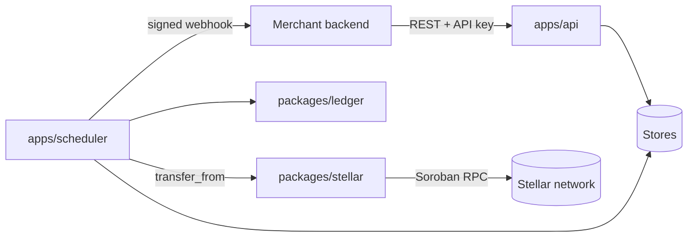

# Architecture

## The shape of it

Two processes over one store. The API only ever writes intent — a plan, a
subscription, a cancellation. The scheduler is the only thing that moves money.

## The billing cycle

`runBillingCycle` runs on a tick (every 60s by default). For each subscription
whose `currentPeriodEnd` has passed and whose retry time, if any, has arrived:

1. Compute the period: `periodStart = currentPeriodEnd`,
   `periodEnd = advance(periodStart, plan.cycle)`.
2. `findByPeriod(subscription, periodStart)` — if an invoice already exists for
   this period it is reused. **This is the idempotency hinge.** A tick that
   crashed after raising an invoice does not raise a second one, and a period
   already `paid` just rolls the clock forward.
3. Raise the invoice in the ledger (`merchant_receivable` debit, `payer_payable`
   credit) and emit `invoice.created`.
4. Charge through the `PaymentExecutor`.
5. On success: invoice `paid` with the transaction hash, ledger entry clearing
   the receivable into `settled`, period advanced, `invoice.paid` emitted.
6. On failure: classify, and either arm the backoff (ADR 0004) or cancel.

Everything that could vary — the clock, the network, the store — is a port, so
the whole cycle runs in a test in under a millisecond with a fake clock and a
mock executor. That is why the retry and month-end tests exist at all: they
would be impractical to write against real time.

## Why the ledger is separate from the invoice table

An invoice is a document; the ledger is the record of value moving. Keeping
them apart means "what does this merchant think they are owed" and "what
actually settled" are answerable independently, and disagreement between them is
detectable rather than invisible. Entries are append-only and every write
asserts debits equal credits per asset; an unbalanced entry throws rather than
being stored.

## Invariants worth knowing before you change anything

- **One invoice per (subscription, periodStart).** Enforced by `findByPeriod`,
  and by a unique index once Postgres lands.
- **Money never becomes a `number`.** Stroops as `bigint` all the way through;
  `formatAmount` only at the serialisation boundary.
- **The period does not advance on failure.** A missed charge stays visible.
- **The engine never signs for a payer.** It spends inside a SEP-41 allowance
  the payer granted, or it fails (ADR 0001).
- **Events are persisted before delivery is attempted.** A webhook that never
  arrives is recoverable through `/v1/events`.

## What is deliberately missing in v0.1

Durable storage, a webhook outbox, multi-instance scheduler locking, usage-based
pricing, plan upgrades through the API (the proration maths exists and is
tested; the endpoint does not), and a dashboard. Each is an open issue rather
than a hidden gap.
